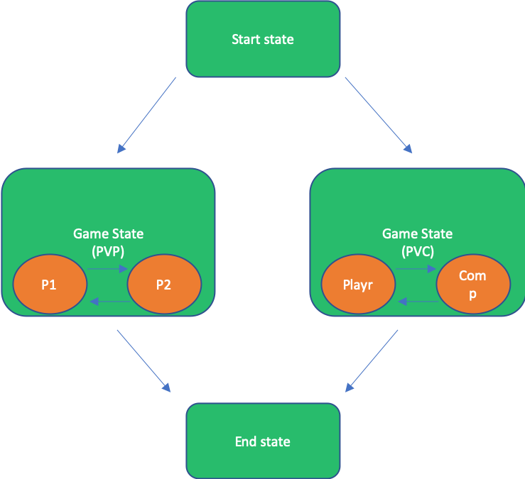

# FSM & Libraries Homework

### Note
* Finish your homework and submit your homework before next Wednesday (28/10/2020) at 12n.n.
* There will be no skeleton code provided so you have to code your own code from the beginning

**Libaries**

```C
#include <stdbool.h>
#include <stdio.h>
#include <stdlib.h>
#include <time.h>
```

**Construct a Five in a Row game by using FSM and Libraries**
Five in a Row is an abstract strategy board game. Two players take turn place their stones on board. Whoever make his stones five in a row first wins the game(vertical, horizontal, and diagonal).

**Game flow** 


## Grading Scheme
#### Printing field[10pts]
* Print a filed with both length and width 15 elements.(recomended do by array)
* If a certain point none occupied, repesent it by a dot(.).
* If a certain point occupied by first-hand side, repesent it by a cross(X).
* If a certain point occupied by second-hand side, repesent it by a circle(O).
example 
```
   1  2  3  4  5  6  7  8  9  0  1  2  3  4  5 x
1  .  .  .  .  .  .  .  .  .  .  .  .  .  .  .
2  .  X  O  .  .  .  .  .  .  .  .  .  .  .  .
3  .  .  X  O  .  .  .  .  .  .  .  .  .  .  .
4  .  .  .  X  .  .  .  .  .  .  .  .  .  .  .
5  .  .  .  .  X  .  .  .  .  .  .  .  .  .  .
6  .  .  .  O  O  X  .  .  .  X  .  .  .  .  .
7  .  .  .  .  .  O  .  .  .  .  .  .  .  .  .
8  .  .  .  .  .  .  .  .  .  .  .  .  .  .  .
9  .  .  .  .  .  .  .  .  .  .  .  .  .  .  .
0  .  .  .  .  .  .  .  .  .  .  .  .  .  .  .
1  .  .  .  .  .  .  .  .  .  .  .  .  .  .  .
2  .  .  .  .  .  .  .  .  .  .  .  .  .  .  .
3  .  .  .  .  .  .  .  .  .  .  .  .  .  .  .
4  .  .  .  .  .  .  .  .  .  .  .  .  .  .  .
5  .  .  .  .  .  .  .  .  .  .  .  .  .  .  .
y
```
#### Construct states[20pts]
* Construct enums: PLAYER1_TURN, PLAYER2_TURN
* Construct states: StartState, GameState, EndState.
* In StartState, you should wait for a key pressed to continue to the gaming stage.
* In EndState, you should wait for a key press to exit the program.
* All the two enums and three states are required, it is fine if you want to create more states.
* 
#### Input coordinate turn by turn and implement fool-proof mechanism[10pts]
* Use scanf("%d %d", &x, &y) to get the input coordinates.
* Change state between PLAYER1_TURN and PLAYER2_TURN each round.
* If a certain point is already occupied, it should not be occupied again.
* If user want to occupy a coordinate out of bounds, it should be banned.
* [Reminder!!!]: x is for horizontal and y is for vertical coordinate.

#### Winning-checking mechanism[15pts]
* Check if any user make five in a row and change state to END_STATE.

#### Construct libraries[45pts]
* Construct structs and libraries: Basic.h and GameField.h.
* Bacis.h: all the enums and states should be defined here[20pts].
* GameField.h: You need to implement a struct called FiveInRowField, and some other helper functions like SetX(), SetO, printField(), Checkwin(), etc[25pts].

### Bonus: Construct Five in a Row player vs computer mode[30pts]
* Construct state: SELECT_MODE
* Create a algorithm that makes reasonable moves
